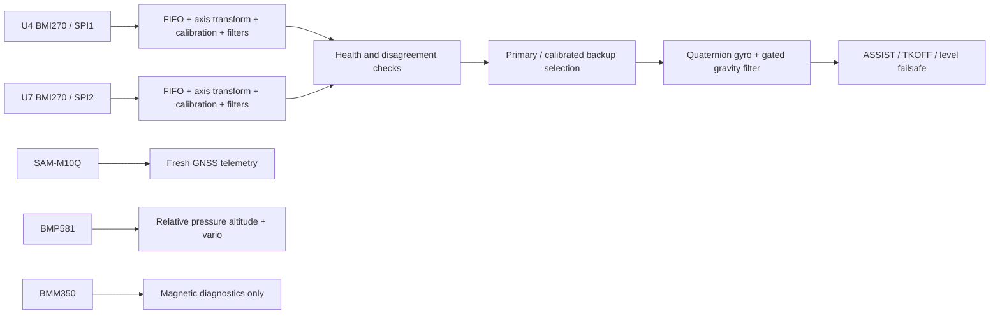

# Sensor fusion and the two BMI270s

**Two IMUs make sense here for fault detection and a calibrated backup. They do not make the whole flight controller redundant.** They share the aircraft, board, MCU, software and major power infrastructure; both can be affected by the same vibration, rail failure, temperature or algorithm error.

The current implementation uses one attitude filter fed by a selected IMU. It does not average two readings blindly, and it is not two independent navigation estimators.

## Implemented data path

### Sampling and calibration

Each BMI270 gets its own Bosch device context and configuration upload, SPI bus, filtered FIFO, scale conversion, gyro calibration, software low-pass state and freshness timer. Accel and gyro run at **400 Hz**, with +/-8 g and +/-2000 deg/s ranges. FIFO data uses the sensor's filtered output; every returned paired sample is processed at the nominal 2.5 ms interval rather than silently taking only the newest sample.

On the first scheduled poll, both FIFOs are flushed once to discard samples accumulated while other devices initialize. Thereafter, a backlog above eight paired samples / 96 bytes is a device fault. This bounds accepted backlog to about 20 ms. The driver checks chip identity, error status, FIFO extraction, saturation and sensor-clock progress; no new sample for 20 ms makes the device unavailable. A device fault does not repeatedly reinitialize hardware during flight.

The two chips' sample clocks are not synchronized. The current driver uses nominal ODR time, with the sensor clock as a progress cross-check; it does **not** reconstruct exact per-frame timestamps or compensate clock drift. Cross-checks compare the latest filtered samples. Those are limitations to measure under real timing/vibration, not a claim of exact sample synchronization.

Gyro bias calibration needs **1600 valid stationary samples (four seconds at 400 Hz)** independently for each chip. The window restarts if movement exceeds the per-axis spread bound, any gyro axis reaches 3 deg/s, acceleration magnitude leaves 0.9-1.1 g, or inputs/timing are invalid. The existing spread bound is 4 deg/s. Calibration is disabled after first arming for the entire boot. After calibration, a 30 Hz gyro low-pass and 15 Hz accelerometer low-pass feed selection/filtering.

This startup window calibrates gyro zero, not accelerometer scale or temperature. Separate six-face body-axis offset/scale support and `tools/calibrate_accel.py` are now implemented; identity coefficients remain until measured. Slow constant rotation below the stationary thresholds is not fully distinguishable from gyro bias. Keep the aircraft physically still. Mechanical mounting alignment is a separate configuration in `src/config/airframe.hpp`.

### Selection and disagreement policy

| Situation | Result |
|---|---|
| Primary healthy, backup healthy | Primary U4 feeds the filter; backup is calibrated and checked |
| Primary fails, calibrated backup healthy | Select U7; preserve attitude and clear the old gyro's learned residual bias |
| Only U7 exists at boot | It can become selected after its own stationary calibration |
| Primary returns after failover | Stay on U7 for this boot; avoid switching back and forth |
| Both unavailable | Attitude is ineligible for stabilization |
| Both calibrated, gyro-vector difference >20 deg/s or accel-vector difference >0.5 g continuously for 100 ms | Latch ambiguous disagreement; stabilization is ineligible until restart/inspection |

A transient sample difference does not immediately trip the disagreement latch. Thresholds are engineering starting points, not values proven on your airframe. With only two sensors, disagreement identifies a problem but cannot identify the correct sensor by majority vote. A disconnected SPI device can be isolated more confidently than two plausible but different sensor readings.

Selection of a healthy calibrated backup keeps stabilization available when the change occurs before the application sees loss of eligibility. If attitude becomes ineligible while ASSIST or TKOFF is active, the application latches a MANUAL fallback until reboot. On RC loss, unavailable/ambiguous attitude instead results in centered surfaces and minimum throttle.

### Attitude fusion

The estimator integrates bias-corrected body gyro rates into a quaternion. A Mahony-style complementary correction uses accelerometer gravity direction when its magnitude and body rotation look suitable. Accelerometer trust tapers to zero as magnitude differs from 1 g by 0.05 g; rate trust tapers from full at 1 deg/s to zero at 3 deg/s. Direction-innovation trust tapers from full at 10 deg to zero at 25 deg. Residual bias learning additionally needs a one-second quiet window, small innovation and near-1-g magnitude, and is bounded to +/-3 deg/s. This reduces errors from maneuvering specific force but cannot fully remove them.

Frames are body **forward/right/down** and world **north/east/down**. The driver applies the PCB mounting rotation, then negates specific force for the gravity-like accelerometer convention. Invalid numeric inputs or invalid estimator time steps invalidate/reset the attitude estimate. Startup attitude needs acceleration magnitude near 1 g.

Long turns and translational accelerations can still corrupt a gravity-only correction; gyro-only intervals drift. A coordinated level turn has increased load factor, and the measured acceleration is not simply an Earth-fixed gravity vector. The current filter does not estimate or subtract aircraft translational acceleration. **Yaw has no absolute reference and can drift.** Do not treat a plausible horizon or heading number as proof of navigation accuracy.

## How the other sensors are used now

**BMP581:** normal 50 Hz measurements, 4x pressure / 1x temperature oversampling, data-ready polling and 200 ms freshness. Pressure is converted to standard-atmosphere altitude; relative pressure altitude uses a reference that tracks before first arming and remains fixed afterward, including RC loss and airborne disarm. Vario is a filtered derivative. This is altitude relative to startup pressure, **not terrain clearance**. Pressure drift, airflow, enclosure pressure and propeller effects remain relevant.

**SAM-M10Q:** valid fresh NMEA position, MSL altitude, satellite count, ground speed and course. Data expires after two seconds and explicit invalid-fix messages invalidate it. Initial baud is 38400 with passive alternate-baud discovery. No receiver configuration or baud change is sent. UBX-NAV-PVT, navigation accuracy estimates and velocity fusion remain future work. Ground speed is not airspeed, so the old groundspeed-based coordinated-turn feedforward is disabled.

**BMM350:** official Bosch initialization and compensation, 25 Hz readings, ready polling, finite-value checks and 200 ms freshness. USB `MAG` reports sensor axes. No airframe hard/soft-iron calibration, body alignment/declination correction or magnetic disturbance rejection is complete, so magnetic values do not enter flight control. The board's VDD/pull-up corrections must happen before useful hardware validation.

## Why not average both IMUs?

Averaging can reduce uncorrelated noise, but also blends a failing sensor into the result. It requires time alignment, individual scale/axis calibration, characterized noise and outlier rejection. Two identically mounted BMI270s can share vibration errors, so averaging offers less benefit than a simple independent-noise calculation suggests. A clean primary/backup implementation provides a more inspectable first version.

An improved design could run two independent attitude/navigation filter instances, compare innovations against GNSS velocity, magnetic field and airspeed, then select the healthier solution. This is materially stronger than comparing only raw accelerometers/gyros, but it needs validated sensor timing and rejection logic. A third sufficiently independent observation helps identify which solution is wrong; simply adding another same-model IMU does not solve shared-power or software failures.

The new [SD logger](LOGGING.md) records both IMUs before/after software processing, independent sequence numbers and reconstructed sample timestamps. Optional notch filtering is disabled pending spectral measurements. See [control and tuning](CONTROL_AND_TUNING.md) for estimator gates and the calibration workflow.

## Recommended next development steps

1. Measure both IMUs stationary, while manually rotated, and under representative motor vibration. Log per-sensor bias, noise, clipping, FIFO age and disagreement to tune thresholds. Preserve exact timestamps before adding blending.
2. Measure and apply the implemented six-face accelerometer calibration. Add persistent parameters and temperature characterization later, with versioning and CRC.
3. Validate BMP pressure placement and magnetic hard/soft-iron calibration; measure motor-current interference before fusing BMM350 yaw.
4. Add timestamped UBX navigation data and a tested velocity/attitude estimator. Consider a calibrated pitot/differential-pressure sensor for fixed-wing airspeed, stall margin and future energy control.
5. Only then add altitude/track control, launch logic, loiter/waypoints and return-to-home with explicit navigation and energy failsafes.

Bosch device definitions and axis conventions come from the [BMI270 datasheet](https://www.bosch-sensortec.com/media/boschsensortec/downloads/datasheets/bst-bmi270-ds000.pdf) and the vendored official APIs. This document describes the implemented firmware and its limitations; it is not a hardware or flight qualification report.
